# BlackRaven Intelligence Platform

> Plateforme sécurisée d'intelligence et d'investigation OSINT.

## 📚 Documentation

Voir [DOCUMENTATION.md](./DOCUMENTATION.md) pour la documentation complète du système (tables, processus, fonctionnalités).

## 🛠️ Technologies

- **Frontend**: React + TypeScript + Vite
- **Styling**: Tailwind CSS
- **Backend**: Supabase (PostgreSQL + Auth + Edge Functions)
- **Déploiement**: Netlify

## 📦 Installation locale

```bash
# Installer les dépendances
npm install

# Configurer les variables d'environnement
cp .env.example .env
# Éditer .env avec vos clés Supabase

# Lancer le serveur de développement
npm run dev
```

## 🔐 Variables d'environnement

Créez un fichier `.env` à la racine (copiez depuis `.env.example`) :

```env
# Supabase
VITE_SUPABASE_URL=https://votre-projet.supabase.co
VITE_SUPABASE_ANON_KEY=votre-clé-anon-publique

# Email (Resend)
RESEND_API_KEY=votre-clé-resend

# PGP
SITE_PGP_ENCRYPTED_PRIVATE_KEY=votre-clé-pgp-encryptée

# Browserless (scraping)
BROWSERLESS_API_KEY=votre-clé-browserless

# Google Maps
VITE_GOOGLE_MAPS_API_KEY=votre-clé-google-maps

# LeakOSINT API (OSINT data leaks search)
VITE_LEAKOSINT_API_TOKEN=votre-token-leakosint
```

## 📁 Structure du projet

```
├── src/
│   ├── components/     # Composants React
│   ├── lib/            # Utilitaires et services
│   ├── App.tsx         # Application principale
│   └── main.tsx        # Point d'entrée
├── public/             # Assets statiques
├── supabase/
│   ├── functions/      # Edge Functions
│   └── migrations/     # Migrations SQL
└── netlify.toml        # Configuration Netlify
```

## 🔒 Sécurité

- Authentification client custom avec sessions
- Authentification admin via Supabase Auth
- Row Level Security (RLS) sur toutes les tables
- Communications PGP chiffrées

## 🗄️ Schéma de Base de Données

### Diagramme ER (Entity-Relationship)

```mermaid
erDiagram
    dossiers ||--o{ targets : "contient"
    dossiers ||--o{ osint_searches : "génère"
    dossiers ||--o{ intelligence_notes : "contient"
    
    targets ||--o{ credentials : "possède"
    targets ||--o{ phone_numbers : "possède"
    targets ||--o{ addresses : "possède"
    targets ||--o{ social_media : "possède"
    targets ||--o{ network_data : "possède"
    targets ||--o{ media_files : "contient"
    targets ||--o{ employment : "a"
    targets ||--o{ connections : "connecté_à"
    targets ||--o{ intelligence_notes : "documenté_dans"
    
    client_users ||--o{ service_requests : "fait"
    client_users ||--o{ glpi_tickets : "crée"
    client_users ||--o{ client_sessions : "a"
    client_users ||--o{ password_reset_tokens : "génère"
    client_users ||--o{ notification_preferences : "configure"
    
    service_requests ||--o{ service_responses : "reçoit"
    
    admin_roles ||--o{ admin_activity_log : "enregistre"
    
    dossiers {
        uuid id PK
        text title
        text code_name
        text access_code
        integer failed_attempts
        boolean is_locked
        text status
        text classification
        uuid user_id FK
    }
    
    targets {
        uuid id PK
        uuid dossier_id FK
        text code_name
        text first_name
        text last_name
        text[] aliases
        date date_of_birth
        text gender
        text status
    }
    
    credentials {
        uuid id PK
        uuid target_id FK
        text service
        text email
        text username
        text password_encrypted
        text password_hash
    }
    
    phone_numbers {
        uuid id PK
        uuid target_id FK
        text phone_number
        text number_type
        text country_code
    }
    
    addresses {
        uuid id PK
        uuid target_id FK
        text address_type
        text street_address
        text city
        text country
        numeric latitude
        numeric longitude
    }
    
    social_media {
        uuid id PK
        uuid target_id FK
        text platform
        text username
        text profile_url
    }
    
    network_data {
        uuid id PK
        uuid target_id FK
        inet ip_address
        text ip_type
        text isp
        text location
    }
    
    osint_searches {
        uuid id PK
        uuid dossier_id FK
        text query
        integer limit_used
        text status
        jsonb raw_results
        jsonb parsed_results
    }
    
    intelligence_notes {
        uuid id PK
        uuid dossier_id FK
        uuid target_id FK
        text category
        text priority
        text content
        text source
    }
    
    client_users {
        uuid id PK
        text email
        text password_hash
        text full_name
        text organization
        text status
        text pgp_public_key
    }
    
    service_requests {
        uuid id PK
        uuid client_id FK
        text service_type
        text encrypted_message
        text status
    }
    
    glpi_tickets {
        uuid id PK
        uuid client_user_id FK
        text service_type
        text title
        text description
        text status
        integer priority
    }
    
    admin_roles {
        uuid id PK
        uuid user_id FK
        text role
        jsonb permissions
    }
    
    map_pins {
        uuid id PK
        text name
        numeric latitude
        numeric longitude
        text category
    }
    
    surveillance_cameras {
        uuid id PK
        text name
        numeric latitude
        numeric longitude
        text country
        text city
        text type
        text stream_url
    }
```



### Tables principales

- **dossiers** : Cas d'investigation avec sécurité par code PIN
- **targets** : Profils de cibles d'investigation
- **credentials** : Identifiants et mots de passe (chiffrés)
- **phone_numbers** : Numéros de téléphone associés
- **addresses** : Adresses physiques avec géolocalisation
- **social_media** : Comptes de réseaux sociaux
- **network_data** : Données réseau (IP, ISP, localisation)
- **osint_searches** : Résultats de recherches OSINT
- **intelligence_notes** : Notes d'intelligence classifiées
- **client_users** : Utilisateurs clients avec authentification custom
- **service_requests** : Demandes de services chiffrées PGP
- **glpi_tickets** : Tickets de support GLPI
- **admin_roles** : Rôles et permissions administrateurs
- **map_pins** : Pins de carte géographique
- **surveillance_cameras** : Caméras de surveillance publiques

## 📄 License

Propriétaire - Tous droits réservés.
